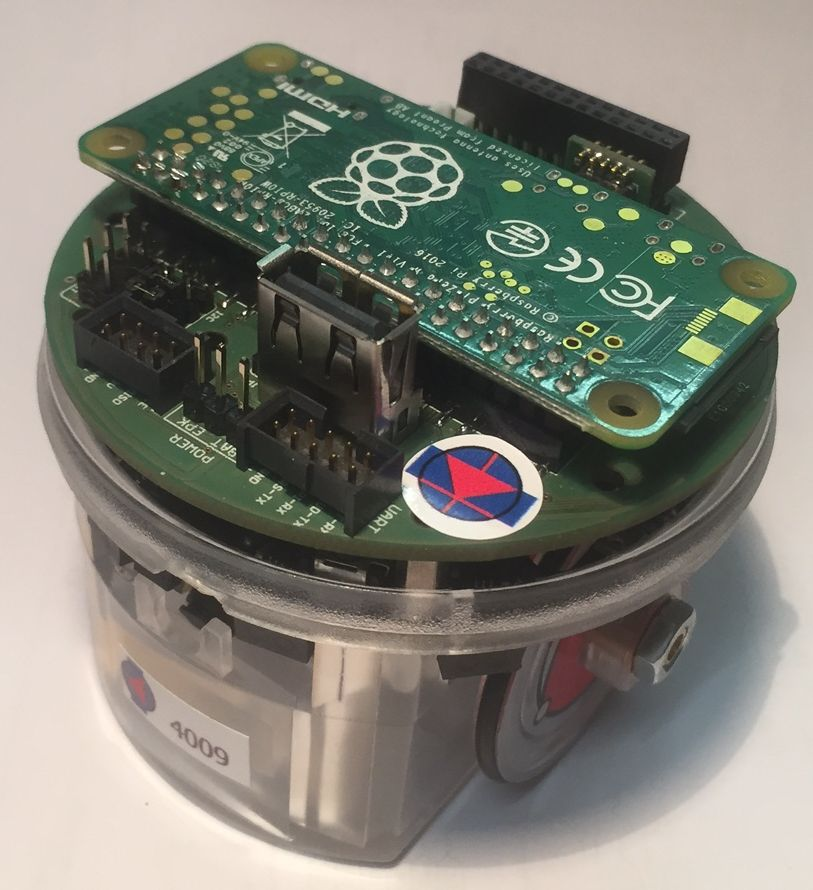

# E-Puck Driver for ROS2
[](https://travis-ci.com/cyberbotics/epuck_ros2)
[](https://opensource.org/licenses/Apache-2.0)
[](http://wiki.ros.org/epuck_ros2)



This ROS2 package adds support for [e-puck](https://www.gctronic.com/doc/index.php/e-puck2) physical robot with [Pi-puck extension](https://www.gctronic.com/doc/index.php?title=Pi-puck).
Please use the following links for the instructions:
- [Installation](https://github.com/cyberbotics/epuck_ros2/tree/master/installation)
- [Getting Started](https://github.com/cyberbotics/epuck_ros2#getting-started)
- [Examples](https://github.com/cyberbotics/webots_ros2/blob/doc-epuck-refactor/webots_ros2_epuck/EPUCK_ROS2.md)
- [Simulation](https://github.com/cyberbotics/webots_ros2/tree/doc-epuck-refactor/webots_ros2_epuck)

## Getting Started
Make sure you followed the [installation tutorial](https://github.com/cyberbotics/epuck_ros2/tree/master/installation), so you have ROS2 and `epuck_ros2` installed on your robot.
If everything properly installed you should be able to source your ROS2 workspace:
```
source $HOME/ros2_ws/install/local_setup.bash
```

Then, launch the driver:
```
ros2 launch webots_ros2_epuck2 example_launch.py
```
This command will activate a ROS2 node with support for all sensors and actuators available on the e-puck except the camera.
We consider the camera node be heavy for device such as Raspberry Pi Zero W and therefore it is not included by default.
You can activate the camera node as:
```
ros2 launch webots_ros2_epuck2 example_launch.py camera:=true
```

Your robot should be ready now and you can check examples [here](https://github.com/cyberbotics/webots_ros2/blob/doc-epuck-refactor/webots_ros2_epuck/EPUCK_ROS2.md).

## Acknowledgement

<a href="http://rosin-project.eu">
  
</a></br>

Supported by ROSIN - ROS-Industrial Quality-Assured Robot Software Components.  
More information: <a href="http://rosin-project.eu">rosin-project.eu</a>

  

This project has received funding from the European Union’s Horizon 2020  
research and innovation programme under grant agreement no. 732287. 
